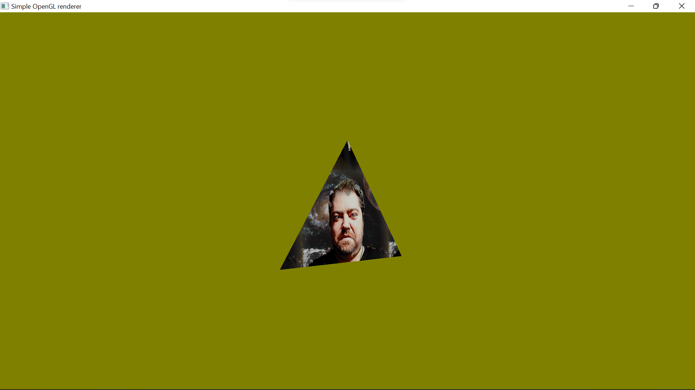

# SIMPLE-OPENGL-RENDERER

Just another simple OpenGL renderer (in OpenGL core profile 4.2) with support for GLSL shaders and textures (via FreeImage library). On top of this project you can build your own rendering system.

# SOFTWARE REQUIREMENTS
You will need these libraries in minimal versions listed here:

      - GLEW (2.1.0)
      - GLFW (3.3.7)
      - FreeImage (3.18.0)
      - GLM (0.9.9)
      
*Note: Add GLEW statically (preprocessor definition: GLEW_STATIC)...*

